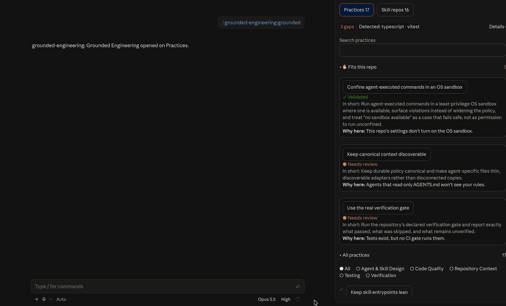
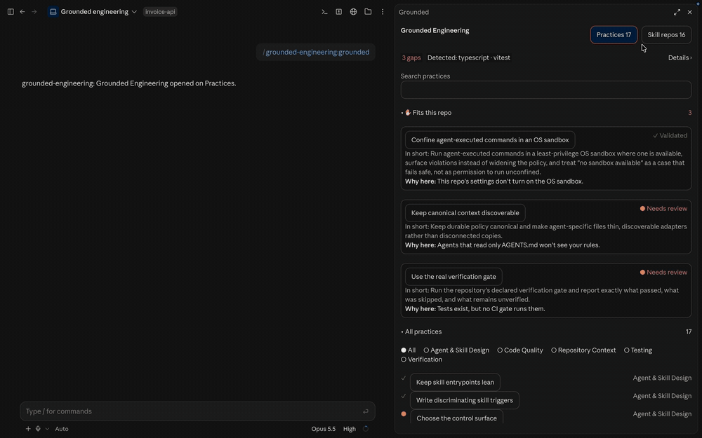

# Grounded Engineering

Engineering practices drawn from mature open-source repositories, each tied to
the source it came from, plus a shelf of reviewed third-party skill
repositories. It runs as a pane inside Claude Code and as a command-line tool.



Type `/grounded` and the pane reads the repository you have open. It shows the
practices that fit what it finds (tests with no CI gate, agent instructions
only Claude reads, no OS sandbox) and why each one applies. **Adapt** asks
Claude to propose the smallest change that brings the practice into your
repository; nothing is written until you approve it. Every card links to the
sources it was drawn from, pinned to the revision that was read.

## Install

### Claude Code plugin

Needs Claude Code 2.1.288 or later, in the terminal or the desktop app's Code
tab.

```text
/plugin marketplace add madjagstudios/grounded-engineering
/plugin install grounded-engineering@grounded-engineering
```

Then type `/grounded`. In the terminal the pane also answers keys: `1` and `2`
switch screens, `d` shows what it detected, and `a` runs the open card's main
action.

### Command-line tool

Needs Node.js 20 or later. The CLI writes the same practices into `AGENTS.md`,
`CLAUDE.md` or a neutral Markdown file, through a proposal you review first:

```bash
npx grounded-engineering adopt preview --profile ai-assisted --adapter claude
```

See [Adopt a profile](#adopt-a-profile) below.

## Skill repos



The second screen lists sixteen third-party skill repositories, each read at a
pinned commit and approved by a maintainer before it is listed. The shelf holds
links and our own short notes only; credit and stars go to the authors.
**Explain install** has Claude read the repository at that commit and list what
it would add (hooks, scripts, network use, settings it changes) before quoting
the author's own install steps. Nothing is installed without your yes, and
slash commands are yours to type. Authors who ask to be removed are delisted. The
records live in [`research/skill-repos/`](research/skill-repos/).

## What is in the catalog

`v0.6.0` is the current release: seventeen practice cards, the Claude Code
plugin with its sixteen-repo shelf, and a CLI with two adoption packs (see
[Adopt a profile](#adopt-a-profile)).

```text
research/       Source observations, pinned references, and category audits
practices/      Short, reusable engineering-practice cards
integrations/   Consumer-specific translation guidance for agent instruction files
plugin/         The Claude Code plugin: pane, skills, and generated catalog
scripts/        Deterministic local validation
```

The recommendations are point-in-time observations against pinned sources.
Source changes do not silently rewrite cards; re-auditing is a deliberate
maintenance step. A card cannot claim a validation state stronger than
`not_validated` without recording, for each source, the revisions it was
checked against.

## Adopt a profile

Adoption does not rewrite existing policy. `preview` only reads, and `create`
stores a proposal under `.grounded-engineering/proposals/<proposal-id>/` for
you to review; nothing is written until `apply --confirm`.

```bash
# one-off, nothing installed
npx grounded-engineering adopt preview --profile ai-assisted --adapter claude

# or install the command
npm install -g grounded-engineering
grounded-engineering adopt create --profile ai-assisted --adapter claude
# Review proposal.yaml, plan.md, and diff.patch; complete local_decisions.
grounded-engineering adopt apply <proposal-id> --confirm
grounded-engineering check
```

Profiles:

- `baseline`: the original eight cards on repository context, code quality,
  testing and verification. Its pack metadata stays at `v0.2.0` so existing
  adopters stay green.
- `ai-assisted`: all seventeen cards.

Adapters:

- `neutral` (default) writes Markdown to `GROUNDED_ENGINEERING.md`.
- `codex` writes to `AGENTS.md`. If a Codex override file governs which
  instructions Codex reads, the tool reports it and writes nothing.
- `claude` writes to the repository-root `CLAUDE.md`. It reports
  `.claude/CLAUDE.md`, nested `CLAUDE.md` and `CLAUDE.local.md` files but does
  not edit them.

`codex` and `claude` write only inside managed blocks keyed by card ID, and
leave everything outside them byte for byte. Apply writes the target and
`.grounded-engineering/manifest.yaml` only after re-checking the proposal's
preconditions. A repository has one adapter target; adding a second waits on
`update propose`, which is still reserved, as is custom `--cards` selection
outside `preview`.

`grounded-engineering check` reads the manifest and the target files and
compares them with the pack bundled in the installed CLI. It exits `0` when
clean, `1` on drift or a repository-state mismatch, and `2` on an invocation
error. The write path is specified in the
[adopt apply policy](policies/adopt-apply.md), which the CLI's help also names;
compatibility notes for each release are in [`CHANGELOG.md`](CHANGELOG.md).

## Evidence posture

The default public evidence form is a paraphrase with an immutable source link and a locator such as a section heading, file path, or pinned commit. Verbatim excerpts are exceptional and require an explicit redistribution decision. Large vendor prompt files and instruction documents are not copied into this repository.

Every practice identifies whether it is observed, recommended, or locally validated. Validation notes are generalized and do not disclose private repository names, paths, tracker IDs, or other internal details.

## Contributing

Start with [`CONTRIBUTING.md`](CONTRIBUTING.md) and [`research/README.md`](research/README.md). Contributions should improve the evidence, the practice, or the translation boundary without collapsing those layers together.

Grounded Engineering is built and maintained with AI agents in real
engineering workflows.

## License

Original repository content is available under the [MIT License](LICENSE). Third-party sources remain subject to their own licenses and terms; links, attribution, and redistribution decisions are recorded with the evidence.
